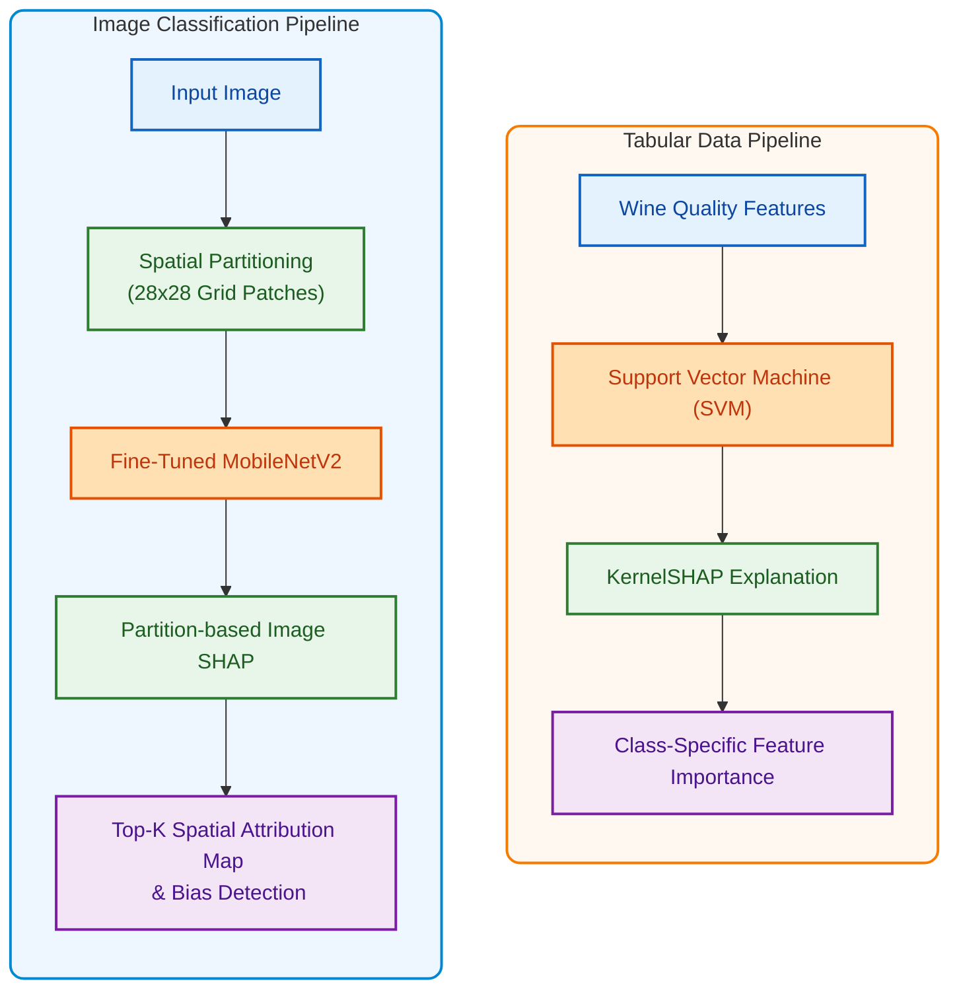
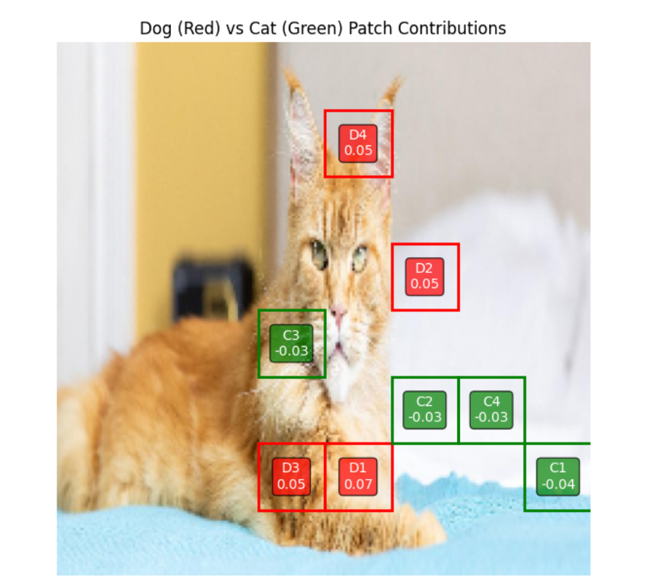
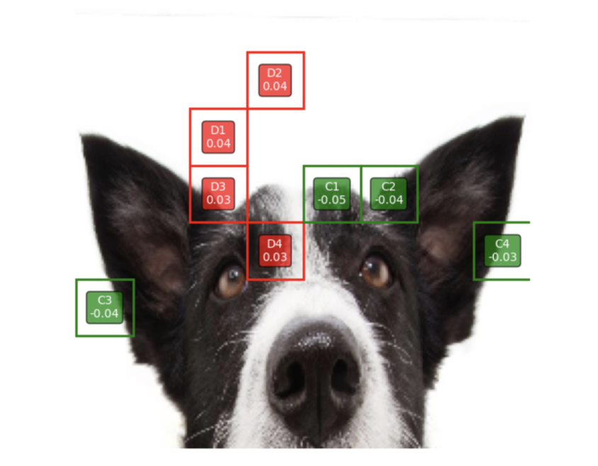

<h1 align="center"> Model Interpretability via Partition-based Image SHAP & KernelSHAP</h1>

<p align="center">
  <b>Explaining Deep Learning & Machine Learning Decisions via Spatial Partitioning & Feature Attribution</b><br/>
  <I>AI 490 — Academic Research & Project </i>
</p>

<p align="center">
  
  
  
  
  
</p>

---

## Abstract

This research investigates model interpretability in computer vision and tabular classification using **SHAP (Shapley Additive Explanations)**. High-capacity machine learning models often exhibit shortcut learning—achieving high validation accuracy while relying on spurious or unintended features.

To address attribution noise in visual explanations, we apply a **Partition-based Image SHAP** framework leveraging $28 \times 28$ spatial grid partitioning on a fine-tuned **MobileNetV2** architecture. For tabular classification, **KernelSHAP** is integrated with a **Support Vector Machine (SVM)** to evaluate class-specific feature contributions under class imbalance.

Our empirical findings demonstrate that while MobileNetV2 achieves high validation accuracy on standard visual benchmarks, SHAP explanations expose a critical dependency on background spatial regions rather than target semantic object features.

---

##  System Architecture & Workflow



---

## 🏷️ Key Keywords

`Explainable AI (XAI)` • `SHAP` • `MobileNetV2` • `KernelSHAP` • `Background Bias Detection` • `Model Interpretability`

---

##  Experimental Setup & Datasets

| Modality | Target Model | Dataset | Interpretability Method | Key Focus |
| :--- | :--- | :--- | :--- | :--- |
| **Vision** | MobileNetV2 (Fine-Tuned) | PetImages (Cats vs Dogs) | Partition-based SHAP ($28\times 28$) | Background vs Foreground Feature Reliance |
| **Tabular** | Support Vector Machine (SVM) | Wine Quality Dataset | KernelSHAP | Imbalanced Class Feature Attribution |

---

## 📊 Feature Attribution & Visual Results

Below are **Top-K Spatial Patch Attribution Maps** generated via Partition-based Image SHAP ($28 \times 28$ spatial grid partitioning), comparing model focus across Cat and Dog test instances.

<p align="center">
  
  &nbsp;&nbsp;&nbsp;&nbsp;
  
</p>

<p align="center">
  <i>Figure 1: Side-by-side Top-K Spatial Patch Attribution Maps for Cat (left) and Dog (right) instances. Red bounding boxes denote positive contributions pushing toward <b>Dog</b> ($D1-D4$), while green boxes denote contributions pushing toward <b>Cat</b> ($C1-C4$). Note the background and artifact reliance across both classes.</i>
</p>

---

## 💡 Key Takeaways & Core Findings

- **Background Bias Exposure:** High validation accuracy can be deceptive. SHAP attributions revealed that the vision model frequently leveraged background context rather than target object semantics.
- **Noise Reduction via Partitioning:** Aggregating fine-grained pixel attributions into fixed $28 \times 28$ spatial grid partitions significantly decreased attribution noise, producing clear local heatmaps.
- **Multi-Modal Diagnostic Capability:** Combining Partition-based SHAP for deep visual networks and KernelSHAP for tabular kernel models provides a unified framework for model auditing.

---

## 📁 Repository Structure

```text
.
├── cat_or_dog_model_dataset/
│   ├── mobileNetv2_partition_shap.ipynb  # Partition-based SHAP implementation on MobileNetV2
│   ├── ft-mobilenetv2-cats-vs-dogs-on-new-data.ipynb # MobileNetV2 fine-tuning notebook
│   └── integrated_grad.ipynb             # Comparative attribution analysis (Integrated Gradients)
├── tabular_data_classification/
│   └── wine_quality_shap.ipynb           # KernelSHAP & SVM classification pipeline
├── assets/                               # SHAP visual outputs & heatmaps
└── README.md                             # Project documentation
```

---

##  Implementation & Technical Stack

This repository contains the experimental code, Jupyter Notebooks, and interpretability workflows developed for this research:

- **Computer Vision Interpretability:** Built with `PyTorch` and `SHAP` using $28 \times 28$ spatial grid partitioning to explain fine-tuned **MobileNetV2** predictions on visual data.
- **Tabular Data Interpretability:** Implemented with `Scikit-Learn` (SVM) and `KernelSHAP` to audit feature attributions under class imbalance on the **Wine Quality** dataset.
- **Experimental Notebooks:** The notebooks located in `cat_or_dog_model_dataset/` and `tabular_data_classification/` document the dataset preparation, attribution calculation, and heatmap generation processes.

---


##  Citation

If you use this work or codebase in your research, please cite:

```bibtex
@misc{yavuz2026shap,
  author = {Yavuz, Elif Özge},
  title = {Model Interpretability via Partition-based Image SHAP and KernelSHAP},
  year = {2025},
  howpublished = {\url{[https://github.com/your-username/your-repo-name](https://github.com/Elif-ozge/XAI-Sota-Shapley-Analysis-on-Tabular-data-and-Binary-Image-Classification)}}
}
```
---

##  Academic Context & License

This repository is developed as part of the **AI 490 Academic Project Class**, focusing on model interpretability and explainable AI (XAI) analysis.

This project is open for educational and research purposes under the [MIT License](LICENSE).
